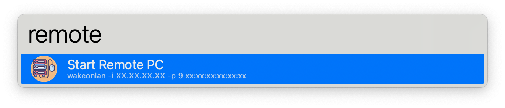
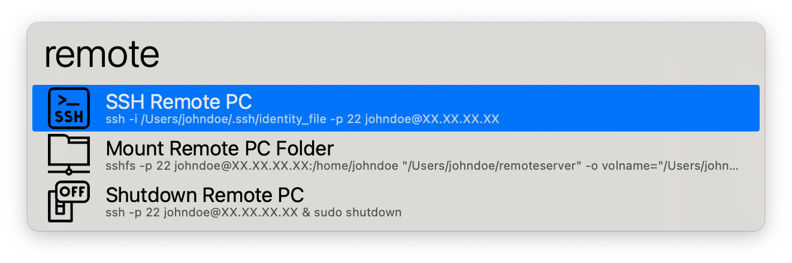

# Alfred Remote Server Control

Alfred workflow to control a remote PC (wake on lan, ssh, sshfs, and shutdown)

## Requirements and setup

On remote PC:
- enable Wake On LAN ([tutorial here](https://www.howtogeek.com/70374/how-to-geek-explains-what-is-wake-on-lan-and-how-do-i-enable-it/))
- ssh server running
- enable `sudo shutdown` command without entering password ([tutorial here](https://stackoverflow.com/questions/25896524/shutdown-in-linux-without-sudo)) 
- if the remote PC is behind a router, make sure the router have a public static IP, and will redirect some ports to the remote PC for wake-on-lan and ssh connection (if you want the workflow to work over the Internet) 

On local machine:
- wakeonlan installed locally (with [homebrew](https://formulae.brew.sh/formula/wakeonlan))
- setup an SSH key pair for logging into the remote PC via SSH without having to enter a password ([tutorial here](https://www.pragmaticlinux.com/2021/05/configure-ssh-for-login-without-a-password/))
- in Alfred workflow configuration, define adresses, ports, username, remote folder to mount, local mounting point, etc.

## Credits 

- Icons designed by [Freepik from Flaticon](https://www.flaticon.com/authors/freepik)

